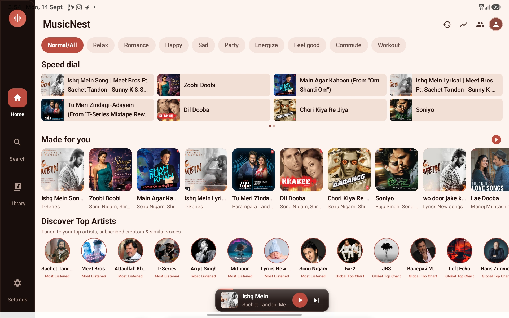
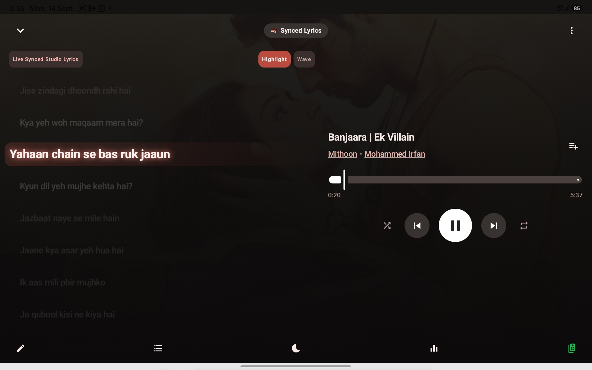
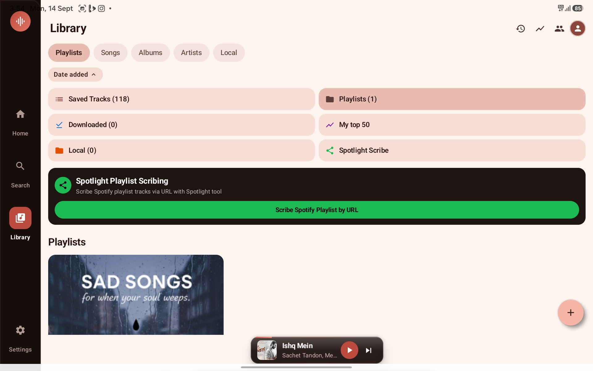

# MusicNest 🎵

MusicNest is an open-source, community-driven audio streaming and music discovery platform designed to offer a modern, clean, and ad-free listening experience. Built with simplicity, cross-platform adaptability, and performance in mind, MusicNest gives listeners complete control over their music without intrusive paywalls or trackers.

<div align="center">

  [](https://github.com/dev-stack12692/MusicNest/releases/latest)
  [](https://github.com/dev-stack12692/MusicNest/releases)
  [](https://github.com/dev-stack12692/MusicNest/releases/latest)
  [](LICENSE)

</div>

---

## 📥 Downloads & Latest Releases

Download the official standalone builds directly from the GitHub releases page:

| Platform | Target Architecture / Type | Package | Download Link |
| :--- | :--- | :--- | :---: |
| **Android** | Android 8.0+ (ARM64 / v7a / x86_64) | Standalone APK (`.apk`) | [Download Latest APK](https://github.com/dev-stack12692/MusicNest/releases/latest) |

> **Android Installation Note:** If you are sideloading the APK for the first time, make sure to permit installations from unknown sources in your browser or file manager (`Settings > Apps > Special app access > Install unknown apps`).

---

## 📸 Screenshots

| Home / Discover | Now Playing | Playlists & Library |
| :---: | :---: | :---: |
|  |  |  |

---

## ✨ Features

* **High-Quality Streaming:** Fast, low-latency audio playback supporting smooth streaming.
* **Modern Minimalist Interface:** Clean layout with dynamic album color accents and responsive controls for mobile and desktop screens.
* **Custom Playlists:** Create, reorganize, and organize your favorite songs and albums locally.
* **Synchronized Lyrics:** View real-time, scrolling track lyrics for supported songs.
* **Offline Caching:** Store tracks locally on your device for uninterrupted playback without an active internet connection.
* **Native Media Controls:** Integrated lock screen, notification shade controls, and keyboard media keys.

---

## ⚖️ Disclaimer

* **Non-Commercial Project:** MusicNest is strictly an open-source, non-profit software application developed for personal utility and educational purposes.
* **Content Ownership:** MusicNest does not host, store, index, or distribute copyrighted media files. All album artwork, song titles, artist trademarks, and audio assets are the exclusive property of their respective owners.
* **No Warranties:** This software is provided on an "as-is" and "as-available" basis without express or implied warranties. The maintainers are not responsible for service interruptions, changes to external API terms, or network issues.

---

## 📜 User Agreement

By downloading, installing, or interacting with MusicNest, you agree to the following terms:

1. **Lawful Application:** You will strictly abide by all applicable regional and international intellectual property, copyright, and digital consumption laws.
2. **Strictly Non-Commercial:** You may not monetize, re-sell, bundle, or distribute MusicNest or its accessed feeds for commercial gain.
3. **API & Server Respect:** You agree not to abuse, spam, reverse-engineer, or overload the backend services or third-party endpoints used by this software.
4. **Service Scope:** Third-party integrations and playback availability may change, be rate-limited, or cease functioning at any time without advance warning.

---

## 🔒 Privacy Policy

MusicNest prioritizes user privacy and follows an absolute zero-tracking approach:

* **Zero Tracking & Analytics:** We do not track, collect, sell, or profile your personal information, search queries, or listening habits.
* **Local Storage First:** All playback history, favorite lists, settings, and cached data remain stored locally on your device storage.
* **Direct Network Access:** Outbound web requests are made exclusively to fetch audio metadata, media streams, and lyrics directly from designated external sources.
* **Third-Party Policies:** Any network communications made to third-party APIs are governed solely by those respective service providers' terms and privacy policies.

---

## 🔌 Use of Third-Party APIs

MusicNest relies on public and free-tier third-party endpoints to provide metadata and audio features:

* **Metadata & Cover Art:** Connects to open music directories to fetch artist information, album tags, and cover graphics.
* **Lyrics Synchronization:** Connects to community lyrics databases to fetch line-by-line synced lyrics.
* **Audio Streams:** Interacts with public endpoints to retrieve open audio streams.
* **Rate Limits:** The client is built to respect standard API rate limits. Users accessing heavy volumes may be prompted to supply individual developer API keys within their client settings.

---

## 🤝 Contributing & Community

MusicNest is **100% free and open-source software**, built purely out of enthusiasm for music and software development.

> **Important Notice Regarding Compensation:**  
> Because MusicNest is a non-profit, free community project, **there is zero financial profit and no monetary compensation for contributors.** All contributions—whether writing code, creating UI/UX designs, fixing bugs, or writing documentation—are entirely voluntary.

If you are interested in contributing, collaborating, or suggesting improvements:

* **Reach Out Directly:** Contact the project maintainer via GitHub ([@dev-stack12692](https://github.com/dev-stack12692)).
* **Open an Issue:** Submit bug reports, track edge cases, or request features in the repository's Issues tab.
* **Submit a Pull Request:** Fork the repository, create a branch for your feature or fix, and submit a PR for review.

---

## ☕ Support the Project

MusicNest is free and will always remain completely free for everyone. If you enjoy the app and would like to support maintenance or buy a cup of coffee for the creator, contributions via **PhonePe / UPI** are welcome!

<div align="center">

  <a href="upi://pay?pa=7318708749@ibl&pn=Swapnendu%20Mal&cu=INR">
    
  </a>

  <br/><br/>

  <p><b>📱 On Mobile:</b> Tap the badge above to open PhonePe or your default UPI app directly to the payment screen.</p>
  <p><b>💻 On Desktop / Manual:</b> Pay directly to UPI ID: <code>7318708749@ibl</code></p>
  <p><b>Payee Name:</b> <code>Swapnendu Mal</code></p>
  


</div>

---

## 📄 License

This project is licensed under the [MIT License](LICENSE).

```text
MIT License

Copyright (c) 2026 Swapnendu Mal and MusicNest Contributors

Permission is hereby granted, free of charge, to any person obtaining a copy
of this software and associated documentation files (the "Software"), to deal
in the Software without restriction, including without limitation the rights
to use, copy, modify, merge, publish, distribute, sublicense, and/or sell
copies of the Software, and to permit persons to whom the Software is
furnished to do so, subject to the following conditions:

The above copyright notice and this permission notice shall be included in all
copies or substantial portions of the Software.

THE SOFTWARE IS PROVIDED "AS IS", WITHOUT WARRANTY OF ANY KIND, EXPRESS OR
IMPLIED, INCLUDING BUT NOT LIMITED TO THE WARRANTIES OF MERCHANTABILITY,
FITNESS FOR A PARTICULAR PURPOSE AND NONINFRINGEMENT. IN NO EVENT SHALL THE
AUTHORS OR COPYRIGHT HOLDERS BE LIABLE FOR ANY CLAIM, DAMAGES OR OTHER
LIABILITY, WHETHER IN AN ACTION OF CONTRACT, TORT OR OTHERWISE, ARISING FROM,
OUT OF OR IN CONNECTION WITH THE SOFTWARE OR THE USE OR OTHER DEALINGS IN THE
SOFTWARE.
